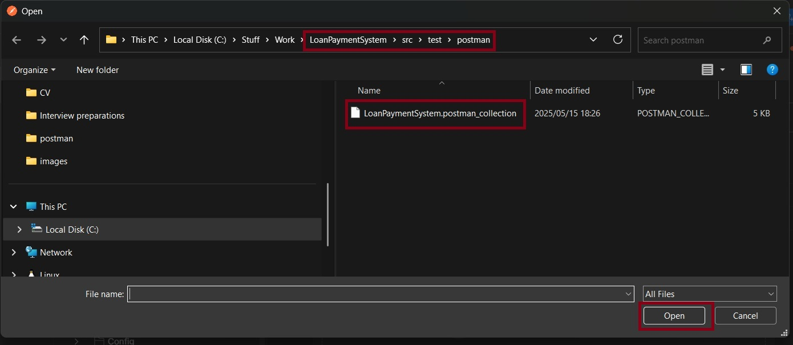
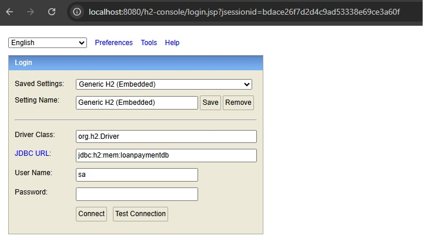

# LoanPaymentSystem
This repo implements a loan payment system in a single Spring Boot application.

The application has two core domains:

1. Loan domain: Handles the loan creation and retrieval.

2. Payments: Handling payments towards loans.

## How to build and run the application

## Prerequisites:

- Java SDK istalled (Java 17 or later)

- Apache Maven installed

- Environment variables JAVA_HOME and MAVEN_HOME properly set

- pom.xml file exists in the project root.

## Building the project:

- Open a terminal in your project directory (where pom.xml is located) and run: 

mvn clean install

## Running the project:

- Open a terminal in your project directory (where pom.xml is located) and run: 

mvn spring-boot:run

OR after building:

java -jar target/loanpaymentsystem.jar

## Running the project:

- Open a terminal in your project directory (where pom.xml is located) and run: 

mvn test

## How to test the APIs

### Location and collection name of Postman collection

You can test the API using the provided Postman collection:

[LoanPaymentSystem.postman_collection](./src/test/postman/LoanPaymentSystem.postman_collection)

The Postman collection is available under the following: 
src/test/postman

### Importing the collection

Select the main menu:  

Select importing from the main menu:

A selector will be shown where you can drag and drop the Postman collection file or select "files":

Navigate to your Postman collection and then "Open":

### Collection Structure

## Additional notes

### H2 in-memory database 
