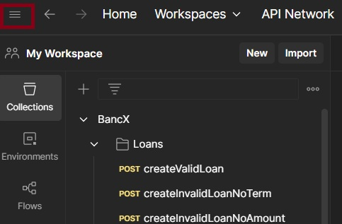
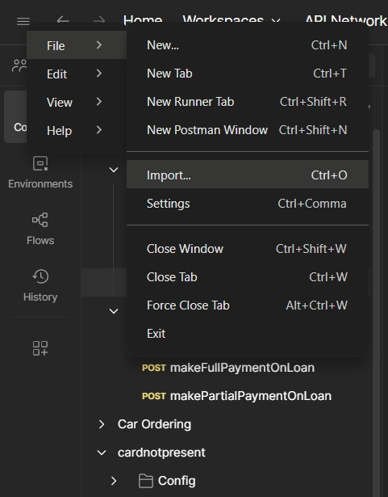
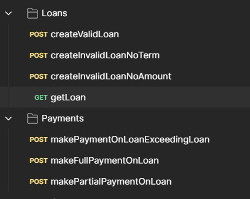

# LoanPaymentSystem
This repo implements a loan payment system in a single Spring Boot application.

The application has two core domains:

1. Loan domain: Handles the loan creation and retrieval.

2. Payments: Handling payments towards loans.

## How to build and run the application

## Prerequisites:

- Java SDK installed (Java 17 or later)

- Apache Maven installed

- Environment variables JAVA_HOME and MAVEN_HOME properly set

- pom.xml file exists in the project root.

## Building the project:

- Open a terminal in your project directory (where pom.xml is located) and run: 

mvn clean install

## Running the project:

- Open a terminal in your project directory (where pom.xml is located) and run: 

mvn spring-boot:run

OR after building:

java -jar target/loanpaymentsystem.jar

## Running the tests:

- Open a terminal in your project directory (where pom.xml is located) and run: 

mvn test

## How to test the APIs

### Base URL

By default, the API is available at:

http://localhost:8080

### Location and collection name of Postman collection

You can test the API using the provided Postman collection:

[LoanPaymentSystem.postman_collection](./src/test/postman/LoanPaymentSystem.postman_collection)

The Postman collection is available under the following:<br>
src/test/postman

### Importing the collection

Select the main menu: <br>


Select importing from the main menu:



A selector will be shown where you can drag and drop the Postman collection file or select "files":


Navigate to your Postman collection and then "Open":


### Collection Structure



The collection for testing the API is divided into 2 folders:

- Loans

- Payments

The names of the API calls are created to indicate the intention of the call:
example: createValidLoan is used for creating a valid loan. 

## Additional notes

### Tech Stack

- Java 17
- Spring Boot
- Spring Data JPA
- H2 Database (in-memory)
- Maven
- JUnit (for testing)

### H2 in-memory database<br>

NOTE: The in-memory database is only available when the application is running.


The in memory database can be accessed via:

http://localhost:8080/h2-console

The JDBC URL needs to be set to:

jdbc:h2:mem:loanpaymentdb

It will then be possible to connect to the database.


# 📘 BancX API Examples

This document provides example API calls for interacting with the BancX loan and payment services.

---

## 🚀 Create a Valid Loan

**POST** `/loans`

```http
POST http://localhost:8080/loans
Content-Type: application/json

{
  "loanAmount": 1000,
  "term": 12
}
```

---

## ⚠️ Create an Invalid Loan (Missing Term)

**POST** `/loans`

```http
POST http://localhost:8080/loans
Content-Type: application/json

{
  "loanAmount": 1000
}
```

---

## ⚠️ Create an Invalid Loan (Missing Amount)

**POST** `/loans`

```http
POST http://localhost:8080/loans
Content-Type: application/json

{
  "term": 12
}
```

---

## 📄 Get Loan Details by ID

**GET** `/loans/{id}`

```http
GET http://localhost:8080/loans/10
```

---

## 💸 Make a Payment Exceeding Loan Amount

**POST** `/payments`

```http
POST http://localhost:8080/payments
Content-Type: application/json

{
  "loanId": 1,
  "paymentAmount": 1200
}
```

---

## ✅ Make a Full Payment on Loan

**POST** `/payments`

```http
POST http://localhost:8080/payments
Content-Type: application/json

{
  "loanId": 1,
  "paymentAmount": 1000
}
```

---

## 💵 Make a Partial Payment on Loan

**POST** `/payments`

```http
POST http://localhost:8080/payments
Content-Type: application/json

{
  "loanId": 1,
  "paymentAmount": 500
}
```

---

