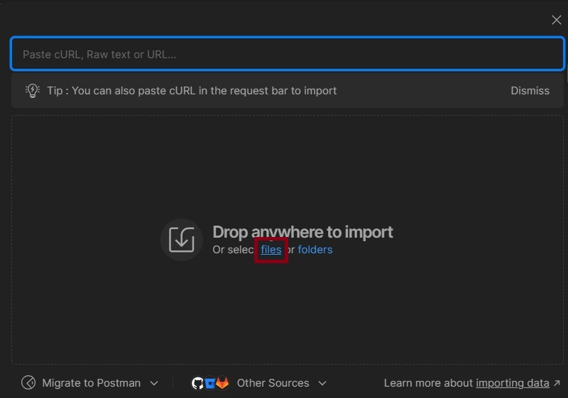

# LoanPaymentSystem
This repo implements a loan payment system.

## How to build and run the application

## How to test the APIs

### Location and collection name

You can test the API using the provided Postman collection:

[LoanPaymentSystem.postman_collection](./src/test/postman/LoanPaymentSystem.postman_collection)

The Postman collection is available under the following: 
src/test/postman

### Importing the collection

Select the main menu:  

Select importing from the main menu:

A selector will be shown where you can drag and drop the Postman collection file or select "files":

Navigate to your Postman collection and then "Open":

### Collection Structure

## Additional notes

### H2 in-memory database 
